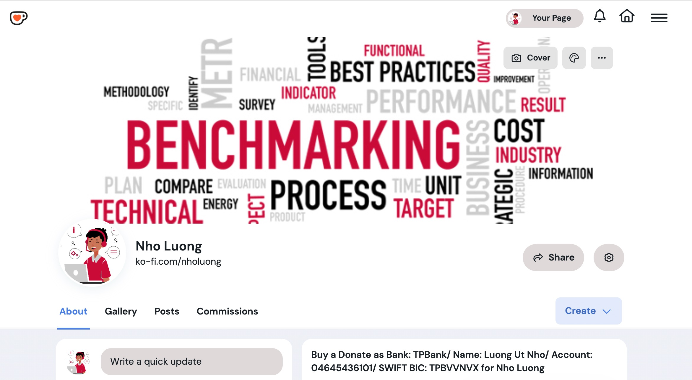

# Qt5 OpenEmbedded/Yocto Project layer


### [View all Roadmaps](https://github.com/nholuongut/all-roadmaps) &nbsp;&middot;&nbsp; [Best Practices](https://github.com/nholuongut/all-roadmaps/blob/main/public/best-practices/) &nbsp;&middot;&nbsp; [Questions](https://www.linkedin.com/in/nholuong/)
<br/>

This layer depends on:

URI: https://github.com/nholuongut/openembedded-core (branch: master)

When building stuff like `qtdeclarative`, `qtquick`, `qtwebkit`, make
sure that you have required `PACKAGECONFIG` options enabled in qtbase
build, see `qtbase` recipe for detail.

Some recipes like qtwebengine would need 32bit multilib compiler on build
host, especially when target to be built is 32bit, e.g. arm since it builds
v8 engine which requires `$CC -m32` to work, so ensure that host compiler
can generate 32bit code, on archlinux distributions this would be
```
pacman -S lib32-gcc-libs lib32-glibc
```

Contributing
------------

Please submit any patches against the `meta-qt5` layer by using the
GitHub pull-request feature.  Fork the repo, make a branch, do the
work, rebase from upstream, create the pull request, yada-yada.

Yocto Project Compatible
------------------------


meta-qt5 has Yocto Project Compatible status since 2013. Check it at:
https://www.yoctoproject.org/product/meta-qt5

## 🚀 I'm are always open to your feedback🇻🇳🇻🇳🇻🇳🇻🇳🇻🇳🇻🇳🇻🇳🇻🇳🇻🇳🇻🇳🇻🇳🇻🇳🇻🇳🇻🇳🇻🇳🇻🇳

# **[Contact Me🇻🇳🇻🇳🇻🇳🇻🇳🇻🇳🇻🇳🇻🇳]**
* [Name: Nho Luong]
* [Skype](luongutnho_skype)
* [Github](https://github.com/nholuongut/)
* [Linkedin](https://www.linkedin.com/in/nholuong/)
* [Email Address](luongutnho@hotmail.com)
* [PayPal.Me](https://www.paypal.com/paypalme/nholuongut)


[](https://ko-fi.com/nholuong)


# License🇻🇳🇻🇳🇻🇳🇻🇳🇻🇳🇻🇳🇻🇳🇻🇳
* Nho Luong (c). All Rights Reserved.🌟
